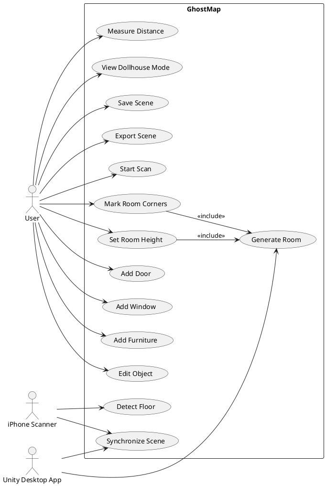
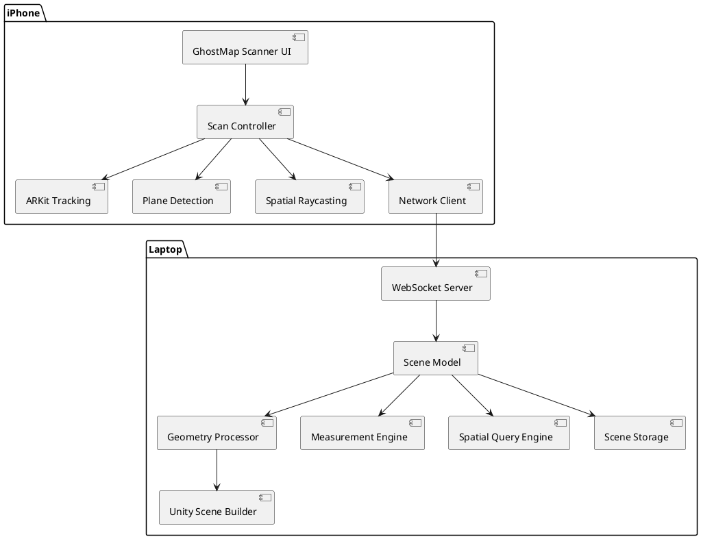
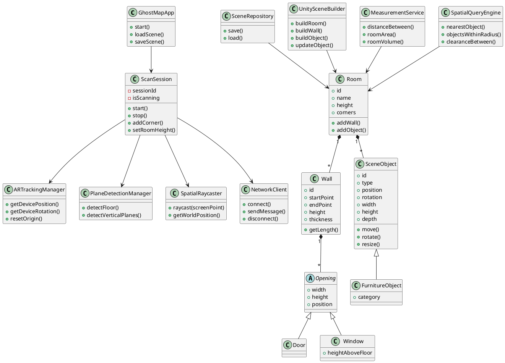
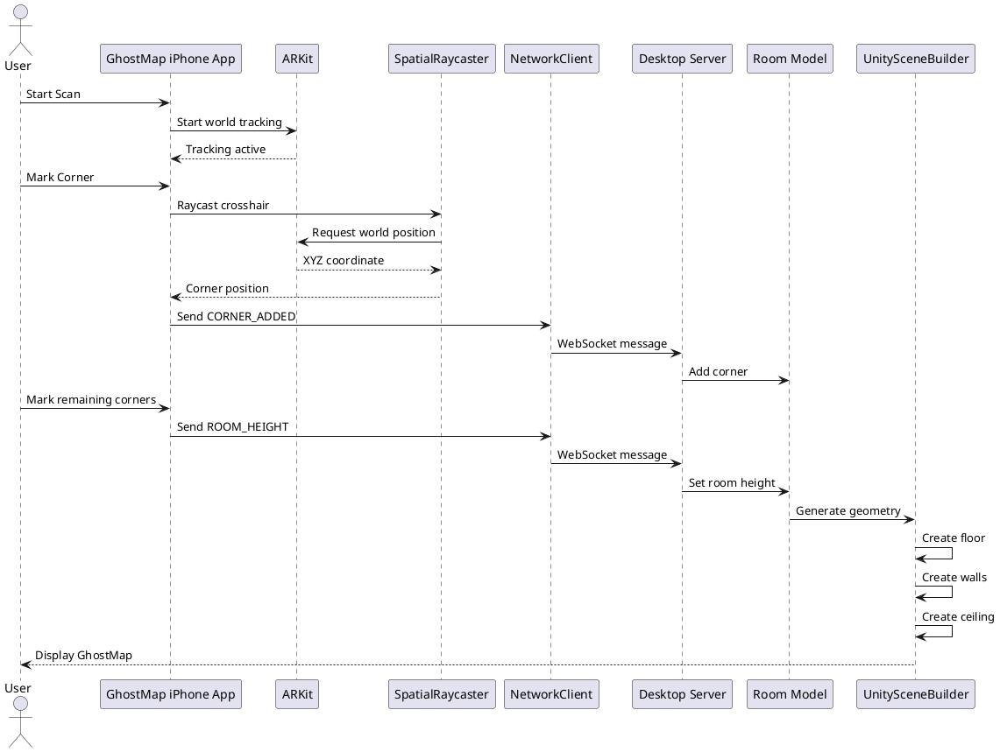
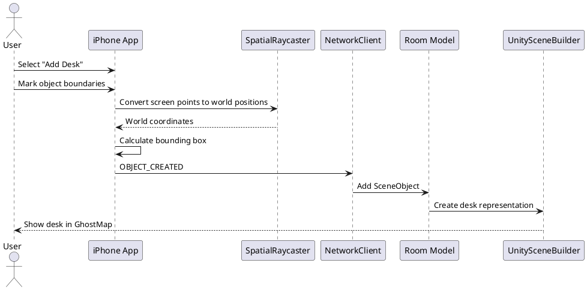
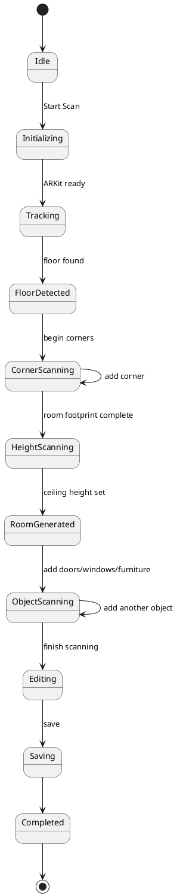
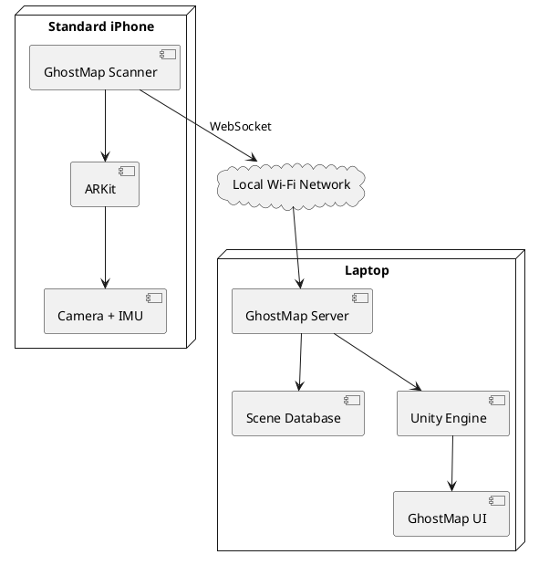

# GhostMap
## Project Specification, UML Diagrams, and CRC Cards

---

# 1. Project Overview

- **Project Name:** GhostMap
- **Project Type:** Mobile spatial-mapping application + desktop 3D visualization system
- **Primary Platform:** Standard non-Pro iPhone + laptop running Unity
- **Primary Goal:** Turn a real physical room into a structured, editable 3D digital environment using only an ordinary iPhone.
- **Core Idea:** Instead of producing a photorealistic scan or giant mesh, GhostMap represents the physical environment as meaningful objects such as:
  - Walls
  - Floors
  - Ceilings
  - Doors
  - Windows
  - Beds
  - Desks
  - Chairs
  - Tables
  - Other furniture

- Each object stores structured spatial information such as:
  - Position
  - Rotation
  - Width
  - Height
  - Depth
  - Object type
  - Relationships to other objects

- Main pitch:
  - **“GhostMap turns any physical environment into an editable, machine-readable 3D world using only your phone.”**

---

# 2. Problem Statement

- Traditional cameras capture images but do not inherently understand the physical structure of a room.
- Existing room-scanning applications often:
  - Require LiDAR-equipped devices.
  - Generate meshes that are difficult to edit.
  - Focus primarily on interior design.
  - Do not expose the room as structured spatial data.
- GhostMap aims to create a lightweight digital twin using:
  - ARKit tracking
  - Plane detection
  - User-assisted measurements
  - Semantic object representation
  - Procedural 3D reconstruction

---

# 3. Project Objectives

- Allow a user with a standard iPhone to scan a room.
- Track the phone's position and rotation using ARKit.
- Detect the floor and major planes.
- Allow users to mark room corners.
- Calculate the room footprint.
- Determine ceiling height.
- Generate walls, floor, and ceiling automatically.
- Allow users to add:
  - Doors
  - Windows
  - Furniture
- Represent every detected item as its own editable object.
- Send scanning data to a laptop in real time.
- Reconstruct the room inside Unity.
- Allow the user to:
  - Move objects
  - Resize objects
  - Rotate objects
  - Delete objects
  - Measure distances
  - Remove walls
  - Remove the ceiling
  - View a floor plan
  - Explore the room in 3D

---

# 4. MVP Scope

## Required MVP Features

- ARKit world tracking
- Floor detection
- Manual room-corner marking
- Room-height measurement
- Procedural floor generation
- Procedural wall generation
- Procedural ceiling generation
- Door placement
- Basic furniture placement
- Real-time communication between iPhone and laptop
- Unity 3D reconstruction
- Dollhouse view
- Object selection
- Object movement
- Object resizing
- Distance measurement

## MVP Example

- User scans a bedroom.
- GhostMap records four room corners.
- User marks the ceiling height.
- GhostMap generates:
  - Four walls
  - One floor
  - One ceiling
- User adds:
  - Door
  - Bed
  - Desk
  - Chair
- Laptop displays the same room in Unity.
- User removes the roof.
- User moves the desk.
- User measures the distance between the desk and bed.

---

# 5. Features Outside the Initial MVP

- Automatic furniture recognition
- Automatic object dimensions
- Monocular depth estimation
- Multi-room scanning
- Whole-building reconstruction
- People tracking
- Advanced AI spatial queries
- Photorealistic reconstruction
- Texturing
- Gaussian splatting
- NeRF reconstruction
- Automatic detection of every object
- Curved-room reconstruction

---

# 6. Target Users

- Students
- Developers
- Architects
- Interior designers
- Robotics researchers
- Accessibility researchers
- Emergency-response teams
- AR/VR developers
- People creating digital twins

---

# 7. User Stories

- As a user, I want to scan a room using my normal iPhone.
- As a user, I want to mark room corners so the system knows the shape of the room.
- As a user, I want GhostMap to automatically generate walls from those corners.
- As a user, I want to add doors and windows.
- As a user, I want to add furniture to the digital room.
- As a user, I want to see the room appear on my laptop while scanning.
- As a user, I want to select and move objects.
- As a user, I want to resize objects.
- As a user, I want to measure distances.
- As a user, I want to remove the ceiling and see a dollhouse view.
- As a user, I want to save the reconstructed room.
- As a developer, I want access to structured spatial data instead of only a mesh.

---

# 8. Functional Requirements

## FR-01: Start Scan

- User can create a new scan session.
- ARKit establishes the world coordinate system.

## FR-02: Device Tracking

- System continuously records:
  - X position
  - Y position
  - Z position
  - Pitch
  - Yaw
  - Roll

## FR-03: Floor Detection

- ARKit identifies a horizontal floor plane.
- Floor becomes the vertical reference point for the room.

## FR-04: Corner Marking

- User aims a crosshair at a room corner.
- User presses "Mark Corner."
- System stores the corner as a 3D point.

## FR-05: Room Footprint

- System connects marked corners.
- System generates a polygon representing the floor.

## FR-06: Room Height

- User marks a ceiling point.
- System calculates vertical distance between floor and ceiling.

## FR-07: Wall Generation

- System generates one wall between every neighboring pair of room corners.

## FR-08: Ceiling Generation

- System generates a ceiling using the room footprint and room height.

## FR-09: Add Door

- User identifies a wall.
- User marks door boundaries.
- GhostMap stores:
  - Width
  - Height
  - Position
  - Parent wall

## FR-10: Add Window

- User identifies a wall.
- User marks window boundaries.
- GhostMap stores:
  - Width
  - Height
  - Position
  - Height above floor
  - Parent wall

## FR-11: Add Furniture

- User chooses an object category.
- User marks object boundaries.
- GhostMap calculates an approximate bounding box.

## FR-12: Real-Time Synchronization

- iPhone sends scene changes to the laptop.
- Unity updates the scene without requiring a full reload.

## FR-13: Object Editing

- User can:
  - Move
  - Rotate
  - Resize
  - Delete
  - Hide
  - Select

## FR-14: Measurement

- User selects two spatial points.
- GhostMap calculates the distance between them.

## FR-15: Dollhouse Mode

- User can hide the ceiling.
- User can orbit around the room from above.

## FR-16: Save Scene

- GhostMap stores the reconstructed environment.

## FR-17: Load Scene

- Previously created GhostMaps can be reopened.

## FR-18: Export Scene

- Scene can eventually be exported as:
  - JSON
  - GLTF/GLB
  - Unity scene data

---

# 9. Non-Functional Requirements

## Accuracy

- Room dimensions should ideally be within approximately 5–15 cm during controlled indoor testing.

## Performance

- Unity should update scene changes within roughly one second over a local network.

## Usability

- A first-time user should be able to scan a simple bedroom without technical knowledge.

## Compatibility

- Scanner should work on ARKit-compatible non-Pro iPhones.

## Reliability

- Loss of network connection should not destroy scan data.

## Modularity

- Scanning, networking, reconstruction, editing, and querying should exist as separate modules.

## Privacy

- Scene processing should not require facial recognition.
- Identity information should not be stored.

---

# 10. Assumptions

- MVP rooms are primarily rectangular or polygonal.
- Walls are mostly vertical.
- Floors are mostly horizontal.
- User moves slowly while scanning.
- Room has enough visual texture for ARKit tracking.
- Phone and laptop are on the same local network.
- Users can manually correct mistakes.

---

# 11. High-Level System Architecture

- **iPhone Scanner**
  - ARKit
  - Plane detection
  - Raycasting
  - Corner marking
  - Object marking
  - Scan session management
  - Network client

- **Network Layer**
  - WebSocket connection
  - Sends structured scene events

- **GhostMap Desktop Engine**
  - Receives spatial data
  - Maintains room model
  - Processes geometry
  - Sends data to Unity rendering components

- **Unity Renderer**
  - Creates room geometry
  - Displays furniture
  - Handles user editing
  - Performs measurements
  - Displays dollhouse mode

---

# 12. Data Model

## Room

- ID
- Name
- Height
- Floor polygon
- Walls
- Doors
- Windows
- Objects

## Wall

- ID
- Start point
- End point
- Height
- Thickness
- Rotation
- Doors
- Windows

## Door

- ID
- Parent wall
- Position
- Width
- Height

## Window

- ID
- Parent wall
- Position
- Width
- Height
- Height above floor

## Scene Object

- ID
- Type
- Position
- Rotation
- Width
- Height
- Depth

## Vector3

- X
- Y
- Z

---

# 13. Example Scene Data

```text
Room
├── Floor
├── Ceiling
├── Wall_01
│   └── Door_01
├── Wall_02
│   └── Window_01
├── Wall_03
├── Wall_04
├── Bed_01
├── Desk_01
└── Chair_01
```

---

# 14. Network Messages

Possible messages between the iPhone and laptop:

- START_SCAN
- STOP_SCAN
- PHONE_POSE
- FLOOR_DETECTED
- CORNER_ADDED
- CORNER_REMOVED
- ROOM_HEIGHT
- WALL_CREATED
- DOOR_CREATED
- WINDOW_CREATED
- OBJECT_CREATED
- OBJECT_UPDATED
- OBJECT_DELETED
- SAVE_SCENE

Example:

```json
{
  "type": "CORNER_ADDED",
  "position": {
    "x": 2.43,
    "y": 0.00,
    "z": 4.81
  }
}
```

---

# 15. Core Classes

- GhostMapApp
- ScanSession
- ARTrackingManager
- PlaneDetectionManager
- SpatialRaycaster
- RoomScanController
- Room
- Wall
- Opening
- Door
- Window
- SceneObject
- FurnitureObject
- NetworkClient
- NetworkServer
- SceneRepository
- UnitySceneBuilder
- MeasurementService
- SpatialQueryEngine
- PathfindingService
- ExportService

---

# 16. UML Use Case Diagram



---

# 17. UML Component Diagram



---

# 18. UML Class Diagram



---

# 19. UML Sequence Diagram
## Room Scanning Flow



---

# 20. UML Sequence Diagram
## Adding Furniture



---

# 21. UML State Diagram
## Scan Session



---

# 22. UML Deployment Diagram



---

# 23. CRC Cards

## CRC Card: GhostMapApp

**Class:** GhostMapApp

**Responsibilities**
- Initialize the application.
- Manage current project.
- Start scan sessions.
- Load saved GhostMaps.
- Save GhostMaps.
- Coordinate major application services.

**Collaborators**
- ScanSession
- SceneRepository
- UnitySceneBuilder

---

## CRC Card: ScanSession

**Class:** ScanSession

**Responsibilities**
- Manage an active scanning session.
- Store temporary scan state.
- Accept room corners.
- Accept room height.
- Track scanning progress.
- Send updates to desktop.

**Collaborators**
- ARTrackingManager
- PlaneDetectionManager
- SpatialRaycaster
- NetworkClient
- Room

---

## CRC Card: ARTrackingManager

**Class:** ARTrackingManager

**Responsibilities**
- Start ARKit tracking.
- Track phone position.
- Track phone orientation.
- Maintain world coordinate system.
- Detect tracking failure.
- Reset tracking origin when necessary.

**Collaborators**
- ScanSession
- ARKit

---

## CRC Card: PlaneDetectionManager

**Class:** PlaneDetectionManager

**Responsibilities**
- Detect horizontal planes.
- Detect vertical planes.
- Identify likely floor plane.
- Provide plane information to scanning system.

**Collaborators**
- ARTrackingManager
- ScanSession
- SpatialRaycaster

---

## CRC Card: SpatialRaycaster

**Class:** SpatialRaycaster

**Responsibilities**
- Convert screen positions into rays.
- Intersect rays with detected surfaces.
- Return real-world coordinates.
- Determine the position of marked room features.

**Collaborators**
- ARTrackingManager
- PlaneDetectionManager
- ScanSession

---

## CRC Card: Room

**Class:** Room

**Responsibilities**
- Represent the complete digital environment.
- Store room dimensions.
- Store room corners.
- Store walls.
- Store doors.
- Store windows.
- Store furniture.
- Add/remove scene objects.

**Collaborators**
- Wall
- Door
- Window
- SceneObject
- UnitySceneBuilder
- MeasurementService

---

## CRC Card: Wall

**Class:** Wall

**Responsibilities**
- Represent one physical wall.
- Store start/end points.
- Calculate wall length.
- Store wall height.
- Store wall thickness.
- Store attached doors and windows.

**Collaborators**
- Room
- Door
- Window
- UnitySceneBuilder

---

## CRC Card: Opening

**Class:** Opening

**Responsibilities**
- Represent an opening in a wall.
- Store width.
- Store height.
- Store position.
- Maintain relationship with parent wall.

**Collaborators**
- Wall
- Door
- Window

---

## CRC Card: Door

**Class:** Door

**Responsibilities**
- Represent a door.
- Store door dimensions.
- Store door position.
- Associate door with a wall.

**Collaborators**
- Wall
- Opening
- UnitySceneBuilder

---

## CRC Card: Window

**Class:** Window

**Responsibilities**
- Represent a window.
- Store window dimensions.
- Store height above floor.
- Associate window with a wall.

**Collaborators**
- Wall
- Opening
- UnitySceneBuilder

---

## CRC Card: SceneObject

**Class:** SceneObject

**Responsibilities**
- Represent an object inside the room.
- Store position.
- Store rotation.
- Store width.
- Store height.
- Store depth.
- Allow object transformation.

**Collaborators**
- Room
- UnitySceneBuilder
- MeasurementService
- SpatialQueryEngine

---

## CRC Card: FurnitureObject

**Class:** FurnitureObject

**Responsibilities**
- Represent furniture.
- Store furniture category.
- Store approximate dimensions.
- Allow resizing and repositioning.

**Collaborators**
- SceneObject
- Room
- UnitySceneBuilder

---

## CRC Card: NetworkClient

**Class:** NetworkClient

**Responsibilities**
- Connect iPhone to laptop.
- Send scan events.
- Send scene updates.
- Detect connection failures.
- Reconnect when possible.

**Collaborators**
- ScanSession
- Desktop Network Server

---

## CRC Card: UnitySceneBuilder

**Class:** UnitySceneBuilder

**Responsibilities**
- Convert room data into Unity GameObjects.
- Generate floor geometry.
- Generate wall geometry.
- Generate ceiling geometry.
- Spawn furniture.
- Update existing objects.
- Remove deleted objects.

**Collaborators**
- Room
- Wall
- SceneObject
- Network Server

---

## CRC Card: MeasurementService

**Class:** MeasurementService

**Responsibilities**
- Calculate distance between points.
- Calculate distance between objects.
- Calculate wall lengths.
- Calculate room area.
- Calculate room volume.
- Calculate object clearance.

**Collaborators**
- Room
- Wall
- SceneObject

---

## CRC Card: SpatialQueryEngine

**Class:** SpatialQueryEngine

**Responsibilities**
- Search the room model.
- Find nearest objects.
- Determine spatial relationships.
- Find objects within a radius.
- Calculate clearances.
- Answer structured spatial questions.

**Collaborators**
- Room
- SceneObject
- MeasurementService

---

## CRC Card: SceneRepository

**Class:** SceneRepository

**Responsibilities**
- Save GhostMap projects.
- Load GhostMap projects.
- Serialize scene information.
- Deserialize scene information.
- Maintain project versions.

**Collaborators**
- Room
- GhostMapApp

---

## CRC Card: PathfindingService

**Class:** PathfindingService

**Responsibilities**
- Generate walkable space.
- Treat furniture as obstacles.
- Find routes through rooms.
- Calculate path clearance.
- Support future accessibility analysis.

**Collaborators**
- Room
- SceneObject
- SpatialQueryEngine

---

## CRC Card: ExportService

**Class:** ExportService

**Responsibilities**
- Export structured room data.
- Generate JSON.
- Export compatible 3D formats.
- Prepare scenes for other applications.

**Collaborators**
- Room
- SceneRepository
- UnitySceneBuilder

---

# 24. Recommended Development Order

- **Step 1**
  - Build ARKit tracking prototype.

- **Step 2**
  - Display live phone coordinates.

- **Step 3**
  - Implement floor detection.

- **Step 4**
  - Implement raycasting.

- **Step 5**
  - Implement room-corner marking.

- **Step 6**
  - Generate room footprint.

- **Step 7**
  - Implement room-height capture.

- **Step 8**
  - Generate walls, floor, and ceiling locally.

- **Step 9**
  - Build iPhone-to-laptop WebSocket connection.

- **Step 10**
  - Reconstruct room inside Unity.

- **Step 11**
  - Add doors and windows.

- **Step 12**
  - Add manually positioned furniture.

- **Step 13**
  - Add object editing.

- **Step 14**
  - Add measurement tools.

- **Step 15**
  - Add dollhouse mode.

- **Step 16**
  - Add saving/loading.

- **Step 17**
  - Only after the MVP works, add:
    - Object recognition
    - Spatial queries
    - Pathfinding
    - Depth estimation
    - Multi-room scanning

---

# 25. MVP Acceptance Criteria

GhostMap MVP is considered complete when:

- A normal non-Pro iPhone can start an AR scan.
- The user can mark at least four room corners.
- The system creates a recognizable room footprint.
- User can set room height.
- Unity generates floor, walls, and ceiling.
- User can add at least:
  - One door
  - Three furniture objects
- Objects appear approximately where they exist in reality.
- User can remove the ceiling.
- User can select an object.
- User can move an object.
- User can resize an object.
- User can measure between two objects.
- Scene can be saved.
- Entire demonstration works without LiDAR.

---

# 26. Hackathon Success Criteria

The strongest demo sequence is:

- Start with an empty Unity scene.
- Open GhostMap on the iPhone.
- Scan the floor.
- Mark four room corners.
- Mark room height.
- Watch the room appear on the laptop.
- Add a door.
- Add a bed.
- Add a desk.
- Add a chair.
- Finish scanning.
- Switch to dollhouse mode.
- Rotate the room.
- Click the desk.
- Move the desk.
- Measure the space between the desk and bed.
- Display the structured scene hierarchy.
- End with:
  - **“A camera sees pixels. GhostMap understands spaces.”**

---

# 27. Final System Vision

```text
Physical Environment
         ↓
    Normal iPhone
         ↓
Spatial Understanding
         ↓
   Structured Scene
         ↓
┌────────┼─────────┐
↓        ↓         ↓
Humans   Robots    Software
↓        ↓         ↓
AR/VR  Navigation  Simulation
```

GhostMap is not simply a room scanner.

It is a system for converting the physical world into structured spatial information that other humans, programs, robots, and simulations can understand.
